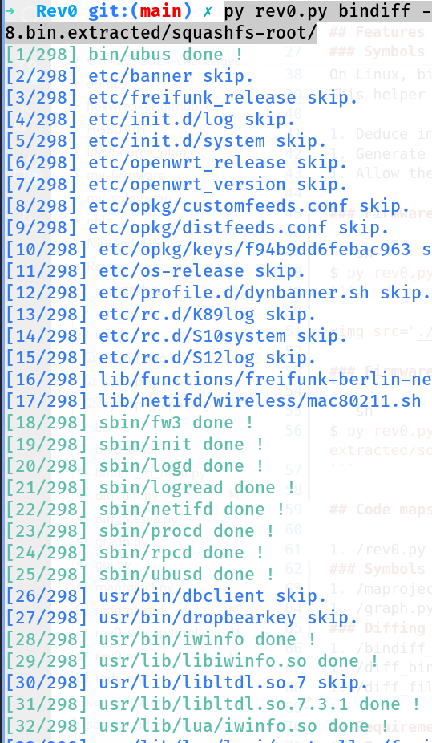

> Author : hexwreaker

# Rev0 : reverse engineering framework

### ⚠️ Currently under development ⚠️

## Features

```sh
usage: rev0.py [-h] [-v] {symap,diff,bindiff,readiff} ...

    The Rev0 project to help you reversing entire filesystems.
    By @hexwreaker on github : https://github.com/hexwreaker.

positional arguments:
  {symap,diff,bindiff,readiff}
                        Available actions
    symap               map the symbols used between binaries/libraries in the filesystem path FS_PATH.
    diff                diffing the primary and secondary filesystems.
    bindiff             diffing common binaries between primary and secondary filesystems. The bindiff results are stored in a filesystem copy, located in the Rev0 project directory. It use the bindiff tool by "Zynamics", the python-binexport tool by "Quarkslab" and need Ida pro beeing installed.
    readiff             Read the bindiff results. Can lookup for a unique file or a full directory.

options:
  -h, --help            show this help message and exit
  -v, --verbose         set the output in verbose mode, print more informations
```

### Symbols graph helper

Usage :

```sh
$ py rev0.py symap /home/hexwreaker/Downloads/firmware/firmware.bin.extacted/squashfs-root/
```


On Linux, binaries are linked to libs. The problem is that we can't know what lib contains the linked function, even is some library names are included into the binary.
This helper help the user to find the libs that contains function used by binaries, in a project.

1. Deduce import links between libraries and binaries.
1. Generate a graphic "link map" to overview the result.
1. Allow the user to click on a link-map 's cell to start reversing the binary using his preferred software.

### Firmware versions diffing

```sh
$ py rev0.py symap /home/hexwreaker/Downloads/firmware/firmware.bin.extacted/squashfs-root/
```


### Firmware binaries diffing

```sh
$ py rev0.py bindiff -i ~/ida-pro/ /home/hexwreaker/Downloads/firmware/_openwrt-19.07.6.bin.extracted/squashfs-root/ /home/hexwreaker/Downloads/firmware/_openwrt-19.07.8.bin.extracted/squashfs-root/
```




## Code maps

1. /rev0.py : main command script.
### Symbols graph
1. /maproject.py : main symbols graph script
1. /graph.py : export to graph 
### Diffing
1. /bindiff_to_html.py : convert the bindiff result in HTML
1. /diff_bin.py : binary diffing 
1. /diff_filesys.py : filesystem diffing 

## Requirements 
### Python
1. lief
1. capstone
1. magic
1. hashlib
1. dash
1. dash_cytoscape
1. pyvis

### Other tools
1. gnu diffutils
1. Quarkslab python-binexport
1. Zynamics's bindiff
